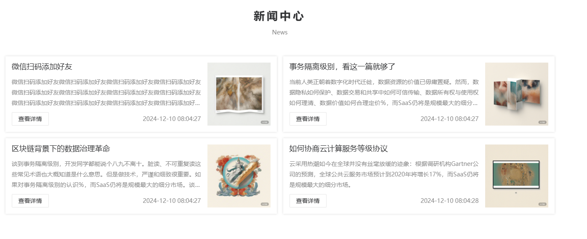
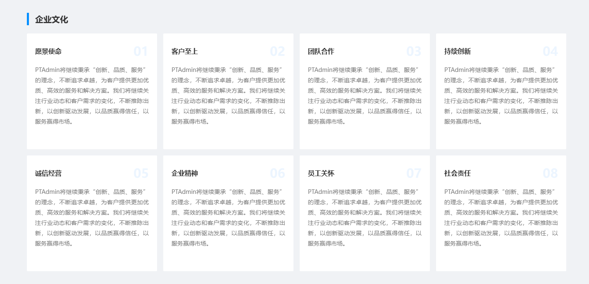
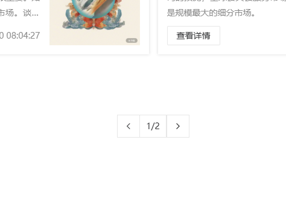
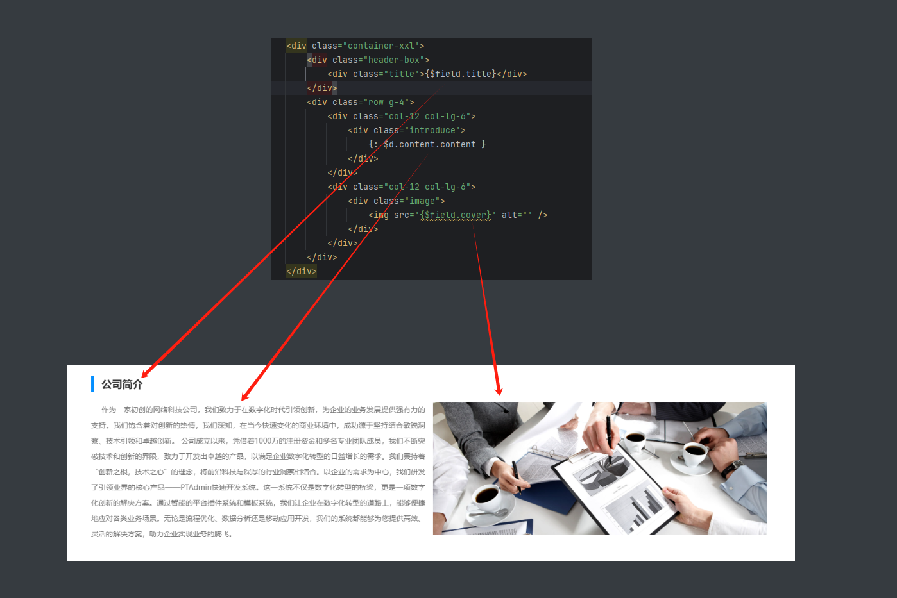
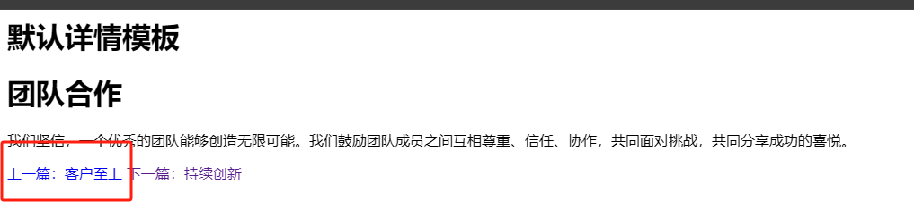
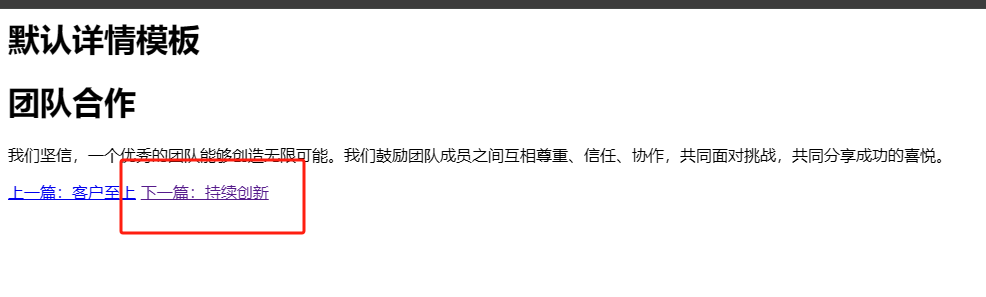

# CMS 指令手册

## 全局参数


| 参数  | 参数名称 | 是否必须 | 默认值 | 示例          | 说明         |
| ----- | -------- | -------- | ------ | ------------- | ------------ |
| limit | 限制条数 | 否       | 8      | 9             | 内容条数限制 |
| order | 排序方式 | 否       | null   | ['id'=>'asc'] | 排序方式     |

### limit、order参数调用示例

```html
@pt:cms::lists(limit='4', order=['id'=>'desc'])

@pt:end
```

### limit、order演示示例



## 全局调用指令

> 全局调用指令可以在任何位置调用都是有效的


### 系统配置 [$pt]

##### 调用示例

```html
{$pt.site.title}   站点标题
{$pt.site.record}   备案号
{$pt.site.company}   公司名称
{$pt.site.address}   公司地址

其余详见系统配置
```

##### 调用演示


### 基础插件调用指令

#### 导航指令 [@pt:base::nav]


| 参数                  | 参数名称   | 是否必须 | 默认值  | 示例                         | 说明                                                                |
|---------------------|--------|------|------|----------------------------|-------------------------------------------------------------------|
| navigation_group_id | 导航分组id | 否    | null | 1\|2\|6                    | 导航分组id（1：默认分组，2:底部，3:商户合作，4：服务支持，5:友情链接，6:测试分组）(可以是多个值，以 "\|" 隔开) |
| category_id         | 分类id   | 否    | null | 1                          | 分类id(可以是多个值，以 "\|" 隔开)                                            |
| type                | 菜单类型   | 否    | null | 1                          | 菜单类型（0:链接，1：页面，2:功能分类，3:目录）(可以是多个值，以 "\|" 隔开)                     |
| cover               | 是否有封面图 | 否    | null | true                       | 是否有封面图( false => 没有封面图；true => 有封面图 )                             |
| fields              | 查询展示字段 | 否    | null | id\|title\|cover\|subtitle | 查询展示字段                                                            |

##### 调用示例

```html
@PT:base::nav(code="default")

@PT:end
```

##### 演示示例


#### 广告指令 [@pt:base::ad]

| 参数             | 参数名称    | 是否必须 | 默认值  | 示例                                    | 说明                                       |
|----------------|---------|------|------|---------------------------------------|------------------------------------------|
| ad_position_id | 广告位id   | 否    | null | 2                                     | 广告位id(可以是多个值，以 "\|" 隔开)                  |
| links          | 是否有广告链接 | 否    | null | true                                  | 是否有广告链接( false => 没有广告链接；true => 有广告链接 ) |
| image是否有广告图片   |         | 否    | null | false                                 | 是否有广告图片( false => 没有广告图片；true => 有广告图片 ) |
| fields         | 查询展示字段  | 否    | null | id\|title\|links\|image\|intro\|click | 查询展示字段                                   |

##### 调用示例

```html
@pt:base::ad(ad_position_id='2',order=['id'=>'asc'])

@pt:end
```

##### 调用演示


- 需求：输出格式为 ``<script src="xxx"></script>``调用方式


#### 友情链接 [@pt:base::link]

| 参数     | 参数名称      | 是否必须 | 默认值  | 示例                                    | 说明                                         |
|--------|-----------|------|------|---------------------------------------|--------------------------------------------|
| image  | 是否有链接Logo | 否    | null | false                                 | 是否有链接Logo( false => 没有广告图片；true => 有广告图片 ) |
| fields | 查询展示字段    | 否    | null | id\|title\|links\|image\|intro\|click | 查询展示字段                                     |

##### 调用示例

```html
@pt:base::link

@pt:end
```

##### 调用演示


### 文章页指令（根据参数获取所有文章信息，没有翻页） [@pt:cms::arc]

| 参数      | 参数名称    | 是否必须 | 默认值  | 示例                                    | 说明                                        |
|---------|---------|------|------|---------------------------------------|-------------------------------------------|
| sons    | 递归子集    | 否    | null | true                                  | 是否递归获取所有子集( true => 是；false => 否)         |
| cid     | 栏目id    | 否    | null | 7\|8                                  | 栏目id                                      |
| ids     | 文章id    | 否    | null | 1\|2                                  | 文章id                                      |
| m_id    | 模型id    | 否    | null | 1\|2                                  | 模型id                                      |
| no_cid  | 排除的栏目id | 否    | null | 7\|8                                  | 排除栏目id                                    |
| fields  | 查询展示字段  | 否    | null | id\|title\|links\|image\|intro\|click | 查询展示字段                                    |
| flag    | 推荐属性标签  | 否    | null | 1\|2                                  | 满足推荐属性（满足任意一个推荐属性）                        |
| no_flag | 不推荐属性标签 | 否    | null | 3\|4                                  | 不满足推荐属性（不包含某些推荐属性）                        |
| cover   | 是否存在封面图 | 否    | null | false                                 | 是否有封面图( false => 没有封面图；true => 有封面图 )     |
| with    | 关联表     | 否    | null | category:id,title\|xxx                | 是否关联表（关联后获取指定字段内容 => xxx:xx,x）多个关联以"\|"分隔 |

##### 调用示例

```html
@pt:cms::arc(category='qywh',with='content',order=['id'=>'asc'],limit='8')

@pt:end
```

##### 调用演示




### 栏目指令[@pt:cms::category]

| 参数        | 参数名称   | 是否必须  | 默认值  | 示例                         | 说明                                    |
|-----------|--------|-------|------|----------------------------|---------------------------------------|
| dir_name  | 目录名称   | 否     | null | about                      | 目录名称（精确查询）                            |
| mod_id    |        | 模型id否 | null | 1                          | 模型id(可以是多个值，以 "\|" 隔开)                |
| cover     | 是否有封面图 | 否     | null | true                       | 是否有封面图( false => 没有封面图；true => 有封面图 ) |
| is_single | 菜单类型   | 否     | null | 1                          | 菜单类型（0:非单页，1：单页）(可以是多个值，以 "\|" 隔开)    |
| fields    | 查询展示字段 | 否     | null | id\|title\|cover\|subtitle | 查询展示字段                                |

##### 调用示例

```html
@pt:cms::category

@pt:end
```

##### 调用演示


### 专题指令[@pt:cms::topic]

| 参数名称    | 是否必须 | 默认值  | 示例                         | 说明                                                |
|---------|------|------|----------------------------|---------------------------------------------------|
| banners | 否    | null | true                       | 是否有banner图( false => 没有banner图；true => 有banner图 ) |
| fields  | 否    | null | id\|title\|cover\|subtitle | 查询展示字段                                            |

#### 调用示例

```html
@pt:cms::topic

@pt:end
```

#### 调用演示


### 单页栏目指令 [@pt:cms::single]

#### 调用示例

```html
@pt:cms::single(category='profile')

@pt:end
```

#### 调用演示


### 文章列表翻页指令

#### 文章列表[@pt:cms::lists]

| 参数          | 参数名称 | 是否必须                  | 默认值  | 示例                 | 说明   |
|-------------|------|-----------------------|------|--------------------|------|
| category    | 栏目名称 | 与category_id两个中必须存在一个 | null | about\|contact\|xw | 栏目名称 |
| category_id | 栏目id | 与category两个中必须存在一个    | null | 1\|2\|3            | 栏目id |
| mod         | 模型名称 | 否                     | null | single             | 模型名称 |
| mod_id      | 模型id | 否                     | null | 1                  | 模型id |


##### 调用示例

```html
@pt:cms::lists(limit='4', order=['id'=>'desc'])

@pt:end
```

##### 调用演示


- tips：栏目中的文章列表指令中的参数均来自与seo配置中的参数


#### 文章列表翻页 [@pt:cms::page]


| 参数      | 参数名称   | 是否必须 | 默认值            | 示例     | 说明              |
|---------|--------|------|----------------|--------|-----------------|
| active  | 当前页标记  | 否    | active         | active | 当前页被选中的标记       |
| class   | 分页模块类  | 否    | page           | 1      | 分页模块类（用于匹配前端样式） |
| layouts | 模型名称   | 否    | prev,page,next | single | 模型名称            |
| align   | 浮动位置样式 | 否    | center         | center | 浮动位置样式（与前端样式相同） |

##### 调用示例

```html
@pt:cms::page(active="active", class="page", layouts="prev,page,next", align="center")

@pt:end
```

##### 调用演示




### 文章详情页指令

#### 内容输出： [{$field.xxx}]

##### 调用示例

```html
{$field.title}     (tips：这里代指获取当前数据中的title)
```

##### 调用演示




#### 上一篇文档 [@pt:cms::prev]

##### 调用示例

```html
@pt:cms::prev
    @if(isset($field['a_url']))<a href="{$field.a_url}">上一篇：{$field.title}</a> @endif
@pt:end
```

##### 调用演示



#### 下一篇文档 [@pt:cms::next]

##### 调用示例

```html
@pt:cms::next
    @if(isset($field['a_url']))<a href="{$field.a_url}">下一篇：{$field.title}</a> @endif
@pt:end
```

##### 调用演示



### 评论指令（思考）

#### 评论表单 [@pt:comment]

#### 评论列表 [@pt:comment::lists]

#### 评论列表 [@pt:comment::page]
